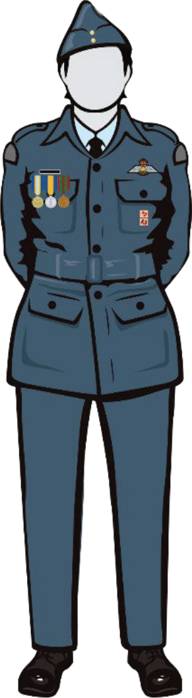

# The Uniform Guide

## Quick Refrences
### Maintenance Guide

Quick Maintenace Guide

|                      	|   Cleaning                     	|   Drying        	|   Wrinkles, Hang Dry   	|   Creases                                                                        	|   Storage  	|
|----------------------	|--------------------------------	|-----------------	|------------------------	|----------------------------------------------------------------------------------	|------------	|
|   Parka              	|   Dry Clean Only               	|   Air Dry Only  	|   Use Steam, Hang Dry  	|   None                                                                           	|   Hanging  	|
|   Tunic              	|   Machine Washable             	|   Dryer         	|   Iron                 	|   None                                                                           	|   Hanging  	|
|   Pants              	|   Machine Washable             	|   Dryer         	|   Iron                 	|   Crease down middle (Front and Back) If look at from below should be a diamond  	|   Hanging  	|
|   Dress Shirt        	|   Machine Washable             	|   Dryer         	|   Iron                 	|   Top Center of Sleeves                                                          	|   Hanging  	|
|   T-Shirt            	|   Machine Washable             	|   Dryer         	|   Iron                 	|                                                                                  	|            	|
|   Tie                	|   Dry Clean Only               	|   Air Dry Only  	|   Iron / Steam         	|                                                                                  	|   Hanging  	|
|   Wedge              	|   Dry Clean Only               	|   Air Dry Only  	|   Iron / Steam         	|                                                                                  	|            	|
|   Boots              	|   Warm Water Only / Wet Cloth  	|   Air Dry Only  	|   High Polish          	|   None                                                                           	|   Covered  	|
|   Toque              	|   Machine Washable             	|   Dryer         	|                        	|                                                                                  	|            	|
|   Belt               	|   Warm Water Only              	|   Air Dry Only  	|                        	|                                                                                  	|            	|
|   Socks              	|   Machine Washable             	|   Dryer         	|                        	|                                                                                  	|            	|
|   Gloves             	|   Machine Washable             	|   Air Dry Only  	|                        	|                                                                                  	|            	|
|   Slip ons/ epaulet  	|   Machine Washable             	|   Air Dry Only  	|   Iron                 	|                                                                                  	|            	|

Maintance Regiment

|  						  							  								 Maintenance Regiment  							 						 					 	|  						  							  								 Between Wear / Regular  							 						 					                                                                                       	|  						  							  								 Every Month  							 						 					                                                                                                                                                                           	|  						  							  								 When Issued or When uniform is handled incorrectly  							 						 					                                                                                                                                                                                                                                                                                                                      	|
|--------------------------------	|------------------------------------------------------------------------------------------------------------------------	|-------------------------------------------------------------------------------------------------------------------------------------------------------------------------------------------------	|-----------------------------------------------------------------------------------------------------------------------------------------------------------------------------------------------------------------------------------------------------------------------------------------------------------------------------------------------------------------------------------	|
|  						  							  								 Parka  							 						 					                	|  					                                                                                                                      	|  					                                                                                                                                                                                               	|  						  							  								 Clean  							 						 					                                                                                                                                                                                                                                                                                                                                                                   	|
|  						  							  								 Tunic  							 						 					                	|  					                                                                                                                      	|  						  							  								 Wash & Press  							 						 					                                                                                                                                                                          	|  					                                                                                                                                                                                                                                                                                                                                                                                 	|
|  						  							  								 Pants  							 						 					                	|  						  							  								 Iron  							 						 					                                                                                                         	|  						  							  								 Wash  							 						 					                                                                                                                                                                                  	|  						  							  								 ←  							 						 					                                                                                                                                                                                                                                                                                                                                                                       	|
|  						  							  								 Dress Shirt  							 						 					          	|  						  							  								 Iron  							 						 					                                                                                                         	|  						  							  								 Wash  							 						 					                                                                                                                                                                                  	|  						  							  								 ←  							 						 					                                                                                                                                                                                                                                                                                                                                                                       	|
|  						  							  								 T-Shirt  							 						 					              	|  						  							  								 Wash and Iron  							 						 					                                                                                                	|  						  							  								 ←  							 						 					                                                                                                                                                                                     	|  						  							  								 ←  							 						 					                                                                                                                                                                                                                                                                                                                                                                       	|
|  						  							  								 Tie  							 						 					                  	|  					                                                                                                                      	|  						  							  								 Iron  							 						 					                                                                                                                                                                                  	|  						  							  								 Wash  							 						 					                                                                                                                                                                                                                                                                                                                                                                    	|
|  						  							  								 Wedge  							 						 					                	|  						  							  								 Iron  							 						 					                                                                                                         	|  					                                                                                                                                                                                               	|  					                                                                                                                                                                                                                                                                                                                                                                                 	|
|  						  							  								 Boots  							 						 					                	|  						  							  								 Fix Up Polish  Use damp cloth with minimal polish and use small circles to gradually return to mirror finish  							 						 					 	|  						  							  								 Base Layer/ Deep  Polish  Add new layer (does not need to be as thick as other layers), and work in large circles to achieve a more resilient finish, if needed follow up with ← this  							 						 					 	|  						  							  								 If you have Boot Cancer or You have New boots with wax; strip the boots.   								 This is done under hot water with a horse hair brush or tooth brush if you can no longer remove any material with your nail then you are done!   								 Apply multiple thick layers of polish these do not have to a perfect finish because they are base layers then follow the the steps ← here  							 						 					 	|
|  						  							  								 Toque  							 						 					                	|  					                                                                                                                      	|  						  							  								 Wash  							 						 					                                                                                                                                                                                  	|  						  							  								 ←  							 						 					                                                                                                                                                                                                                                                                                                                                                                       	|
|  						  							  								 Belt  							 						 					                 	|  					                                                                                                                      	|  						  							  								 Clean  							 						 					                                                                                                                                                                                 	|  						  							  								 ←  							 						 					                                                                                                                                                                                                                                                                                                                                                                       	|
|  						  							  								 Socks  							 						 					                	|  						  							  								 Wash  							 						 					                                                                                                         	|  					                                                                                                                                                                                               	|  					                                                                                                                                                                                                                                                                                                                                                                                 	|
|  						  							  								 Gloves  							 						 					               	|  					                                                                                                                      	|  						  							  								 Wash  							 						 					                                                                                                                                                                                  	|  					                                                                                                                                                                                                                                                                                                                                                                                 	|
|  						  							  								 Slip ons/ epaulet  							 						 					    	|  					                                                                                                                      	|  						  							  								 Iron  							 						 					                                                                                                                                                                                  	|  						  							  								 Wash and Iron  							 						 					                                                                                                                                                                                                                                                                                                                                                           	|

## Maintenance/Setup Guides

Boots

1. If you have excessive boot cancer or have new boots with wax, you need to strip them. Stripping is done by placing the boot under hot water and then scrubbing with a horsehair brush or toothbrush until the polish is removed; to check if the polish is removed, stretch the boot with your nail. If any material comes off, then continue curbing. If not your done with step 1
2. Use a horse Hair Brush and gently remove dust from the boot, be sure to clean any boot cancer off.
3. Polish Welts, take a toothbrush and dip it in your polish. Go around the welts and apply a little bit of polish to blacken them.
4. Apply a base coat, wrap the polishing cloth over your finger and ensure there are no wrinkles beneath, dip your finger into some water, apply a large about of polish but do not rub it in, and make sure the application is smooth but the surface should be a matt grey/black. Let the boot rest for 5-10 minutes. Take a horsehair brush and buff the layer. The layer should begin to have a sheen. 
    1. To add extra base layers, take a sizeable amount of polish, apply it to the b oot, then buff with horsehair
5. Polishing layer, apply minimal polish to your cloth in the same method as previously detailed (see step 4), but this time with more water. You can also add some water to the polish on your finger. In small circles, go around the desired area; your boot will first go dull, and then, as the polish is applied, you will begin to see the boot shine. Repeat this step until you achieve a good finish.
#### Note : for regular polishing, use steps 1 and 5. If the boot has endured damage or heavy wear, repeat step 4.1.
#### Definitions
- Base Layer: A thick layer of polish to be applied to fixture significant imperfections in the boot, applied in a thick layer and buffed with horsehair; use more polish than water
- Polishing Layer: A thin coat is used to fix minor imperfections; you should use more water than polish. Materials Needed: Kiwi Polishing Kit check Walmart they usually stock them

Trousers

To ensure proper creasing on your pants it is recommended to starch them. To properly starch your pants start by spraying an aqueous solution of starch on the inside of your pants, then crease them down the middle front and back. To ensure proper storage, use a pant hanger and store them folded along your creases.

Sewing

- **NEVER: Use glue or other adhesive to attach insignias this will wreck the uniform (remember they are on loan to you)**
- Get someone to help you mark where to put your insignias then roughly attach it and double check before properly sewing it on.
- Make sure to fully sew on your insignias, do not make pencil holders.

### Sewing Diagrams

Left Sleeve

Right Sleeve

For the exact placement of badges/accroutments check the full uniform orders

Beret Shaping

- Cut out the inside of the beret, avoiding cutting off areas that secure the badge and ventilation holes.
- Place the beret on your head, step into your shower, align the badge with the center of your left eye, and hook your thumb beneath it; turn on the shower and shape the beret by pulling to the right and smoothing the top. Once you are done with your shower, dry it with a cloth, then place it over an inverted bowl to dry without losing its shape; or, let it dry on your head. 

General Pressing and Ironing

- Double check the setting on your iron to make sure you are ironing at a appropriate temperature, going to hot will turn you uniform shiny.

## Wear Guide 
** Note: This Section only includes common dress orders, check the the complete uniform orders for others
### C1: Ceremonial Dress (Usually worn on CO's Parade or other formal parades)

Includes

- Wedge / turban with Air Cadet headdress insigna
- Cloth cap badge.
- Environmental dress shirt.
- Necktie.
- Jacket with belt.
- Trousers.
- Belt.
- Boots.
- Socks.
- Medals.
- Pins.
- Cloth glider power pilot badge.

Image

### C2: Mess Dress

Includes

- Environmental dress shirt (white dress shirt optional).
- Necktie (black bow tie optional).
- Jacket.
- Trousers with belt.
- Boots.
- Socks.
- Ribbons.
- Pins.

Image

### C5: Training Dress

Includes

- Wedge, beret / turban with Air
- Cadet headdress insigna, toque or wide-brimmed tan summer hat.
- Field shirt.
- Rank slip-ons.
- Environmental (blue) / squadron / CTC t-shirt.
- Field pants and belt.
- Socks.
- Multi-Purpose Boots (alternative footwear may be authorized when necessary based on the activity).

**Note: Can be worn with sleeves rolled up**

Image

## Acknowledgments
CSS style provided by [jasonm23](https://github.com/jasonm23/markdown-css-themes) 

This site is being hosted on [github.io](https://github.io) 

